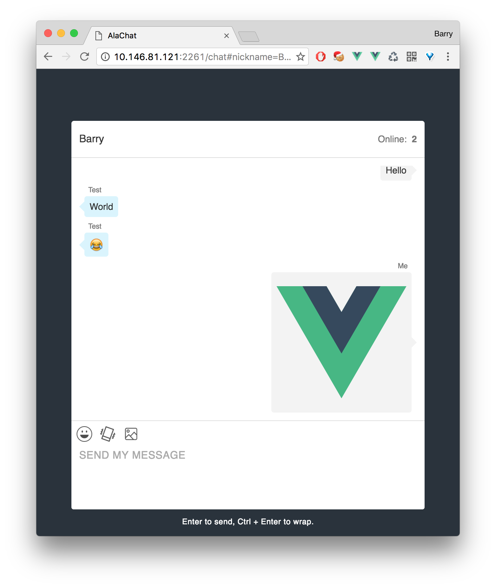

## nodejs_chat-room

主要还是一个聊天的小玩意儿，照着 `socket.io` 官方文档一步步写下来，花了点时间去理解。其中主要是事件的触发和数据的传递，当然还有很多其他功能等着去发现。

想玩的人可以克隆下整个目录，之后进入下好的目录运行：`npm i`，安装运行依赖的模块。

下载完成之后运行 `npm run chat`。

浏览器打开：`127.0.0.1:2261/chat` 即可查看，前提是安装了 `nodejs` 的运行环境。

多人聊天需要把 `127.0.0.1` 改成本机 `ip`，实现局域网内的通信。

这是现在的基本样子，仿的 `Mac QQ` 界面：



### 用到的技术点：

* `nodejs` 来搭建服务器，`express` 快速开发 `web` 平台

* `MySQL` 用来存储需要的值，目前还没有使用到

* `socket.io` 用作及时聊天数据的传输

* `Vue` 用来写单页面应用，`MVVM` 模式

### 现有功能：

* 显示在线人数

* 显示谁加入聊天，谁离开聊天

* 窗口抖动（并显示谁抖的）

* 浏览器消息通知（暂时只在 `chrome` 里测试过）

* 发送可爱滴 `emoji`，数量有限，暂时放了 `60` 个

* 发送图片，小于 5MB

### 目前还需要添加的功能：

* 保存最后一次聊天的 10 条消息记录，但是没有啥想法，用 `MySQL`？

### 发现的小问题

刚把本地项目部署在了 `heroku` 上，因为是免费的，所以响应时间有点小慢。之后测试的话发送图片和 `emoji` 是没有问题的，但是发送图片的时候程序会突然中断，并在 `logs` 里面有错误：

```js
Node.js throw new Error('Can\'t set headers after they are sent.');
```

在 `StackOverflow` 上找了半天找到了原因，是因为 `res.send` 执行了两次，两次的顺序也没有放在同一个回调函数里，所以解决的方案是把需要返回的值先统一记录在一个变量里，最后统一发送给客户端。

现在代码没有报错了，但是图片并没有保存在指定的目录中，然后发现得把保存图片的目录先新建好才行。

总的来说过程很痛苦，结局很开心，还有很多需要优化的地方，这只是个开始。

### 写在结尾的话：

开发在 `dev` 分支上进行，主要是之前说的，前端用了 `MVVM` 框架 `Vue` 来重写，尤大神太棒。然后用了 `pug` 来进行 `html` 的书写。基本上以前写过的方法都要重新融入进 `Vue` 里面，然后新加入了一些其他功能。

以后有想到的新功能都会加上去并实现，代码还是要写的优雅。